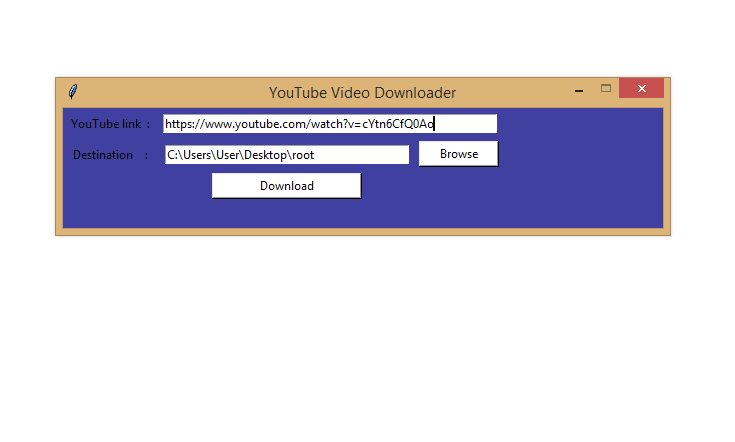

# Youtube-Video-Downloader
This is a Youtube Video Downloader developed using Python. 
## MODULES REQUIRED 
<ol>
  <li>Pytube</li>
  <li>Tkinter</li>
 </ol>
 Use `pip install pytube3` to install pytube.Tkinter is a default installed in python. 
 
 ## STEPS TO RUN THE APPLICATION

 <ol>
  <li>Download the zip file of this repository.</li>
  <li>Run the app.py file.</li>
  <li>The youtube video downloader application opens up.</li>
  <li>Paste the youtube video url in the field.</li>
  <li>Create a root folder in your desktop where all the videos will be downloaded.</li>
  <li>Click on Download.The download starts and after completing shows you 'successful' message.</li>
  </ol>
  

